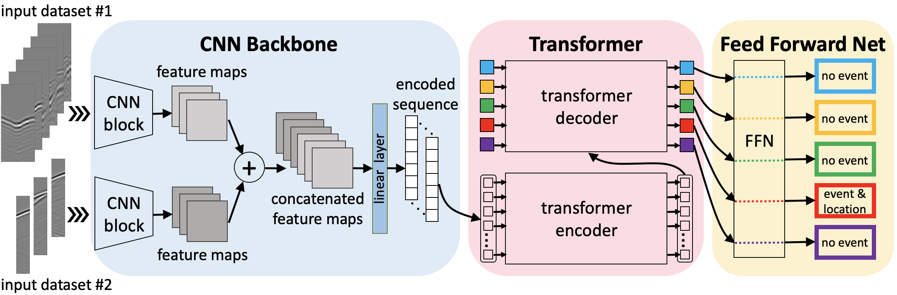

Reproducible material for

**Deep Learning-based 3D Microseismic Event Direct Location Using Simultaneous Surface and Borehole Data - Yuanyuan Yang, Omar M. Saad, Tariq Alkhalifah**


# Project structure
This repository is organized as follows:

* :open_file_folder: **asset**: folder containing logo;
* :open_file_folder: **data**: folder containing data for network training;
* :open_file_folder: **MEDL**: python libraries containing the main code and all packages;
* :open_file_folder: **network**: folder used for holding the trained networks;
* :open_file_folder: **scripts**: python scripts used to run experiments;

## Getting started :space_invader: :robot:
To ensure reproducibility of the results, we suggest using the `environment.yml` file when creating an environment.

Simply run:
```
./install_env.sh
```
It will take some time, if at the end you see the word `Done!` on your terminal you are ready to go. 

Remember to always activate the environment by typing:
```
conda activate forge
```

**Disclaimer:** All experiments have been carried on a Intel(R) Xeon(R) CPU @ 2.10GHz equipped with a single NVIDIA RTX A6000. Different environment 
configurations may be required for different combinations of workstation and GPU.

## Run experiments
Go to the folder ```scripts``` and run in the terminal:
```
bash run.sh
```

## Cite us
If you find our work useful, please cite: